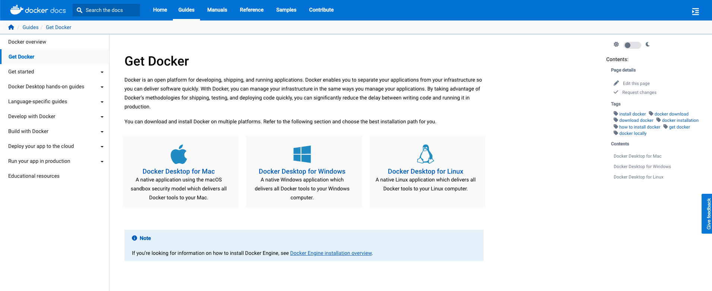

# Preparation Necessary for the workshop

We ask the participants to come with the following required steps:

## **Docker**

Users will need to install Docker software on their laptop. To install the Docker software, go to the Docker website, and create a Docker account. The free “personal” version of Docker desktop can be used.

One you are logged into the Docker website, navigate to the “Downloads” page and select the Docker Desktop version (Mac, Windows, Linux) that matches the operating systems on your laptop.

The Docker Desktop installation process varies between operating systems. Please contact the workshop’s technical support people on the workshop Slack channel for help if you have problems installing the Docker Desktop software on your system.

In some cases, you may need System Administration privileges to install Docker. Open a browser and type the url :``https://docs.docker.com/get-docker/``.

## **SSH**

On Linux and Mac, you should be familiar with using Terminal and basic shell scripting to log in to remove linux servers. We will make use of ``ssh``.

On Windows, you should use

## **AWS Accounts**

If you have been assigned a cloud account for this workshop, you need to set up AWS accounts prior to the start of the worksop. Contact Marine Denolle or Yiyu Ni via direct message on slack with your prefered username to log in and your preferred email address.

1. log in with your designated IAM User to this console: https://806812320051.signin.aws.amazon.com/console
2. Choose the username that was decided by you and the workshop admin (IAM user nae account). 
3. As a first log in, the auto generated password will need to be replaced. Use a sophisticated password to confirm with AWS security standards.